<h1 align="center"><b>Trabalho Análise Assintótica</b></h1>

    
    
    

## 📌 Sumário
- [Introdução](#introdução)
- [Objetivos](#objetivos)
- [Problema Apresentado](#problema-apresentado)
- [Arquivos](#arquivos)
- [Resolução do Problema](#resolução-do-problema)
- [Resultados](#resultados)
- [Conclusão](#conclusão)
- [Compilação e Execução](#compilação-e-execução)

## Introdução

    Nesse trabalho é analisado 3 diferentes funções que acham um valor mínimo e máximo em um vetor. Cada uma dessas funções recebe 3 diferentes tipos de vetores:
    - Randomico
    - Crescente
    - Decrescente
    Com 4 tamanhos de entrada do vetor:
    - 1000
    - 10000
    - 100000
    - 500000

## Objetivos

 
    O principal objetivo é ter uma compreensão mais aprofundada nas diferentes implementações do algoritmo MinMax, e principalmente como elas se comportam em diferentes cenários de entrada.

## Problema Apresentado
<strong><h4>Instruções:</h4></strong>

1. **Implementação dos Algoritmos**
    - Implementar, utilizando C/C++ e seguindo as melhores práticas de programação, os três algoritmos apresentados em sala: MinMax1, MinMax2 e MinMax3.

2. **Avaliação dos Métodos**
    - Avaliar os métodos utilizando diferentes tamanhos de entrada: 1.000, 10.000, 100.000 e 500.000 elementos do tipo inteiro. Esses conjuntos de dados devem ser gerados com valores variando entre 0 a 1000.
    - Cada algoritmo MinMax deve ser executado 10 vezes para cada tamanho de entrada. O tempo de execução obtido será a média dessas 10 execuções.
    - É importante ressaltar que o mesmo conjunto de dados inicial deve ser utilizado para todas as avaliações de um determinado tamanho N de valores. Além disso, considere utilizar os mesmos dados para compor suas variações ordenadas, crescente e decrescente.

3. **Elaboração de Planilhas e Gráficos:**
    - Com base nos tempos obtidos, elaborar uma planilha no Excel para analisar as relações de tempo de forma gráfica.
    - Recomenda-se categorizar os dados por classe, como por exemplo, todos os conjuntos de dados avaliados de 1000 entradas. Outra abordagem é detalhar as comparações por algoritmo quando os dados mudam, considerando tanto conjuntos de dados em ordem crescente como decrescente.

4. **Disponibilização do Código no Git:**
    - Subir o código desenvolvido para um repositório Git.
    - No arquivo README.md, detalhar os experimentos realizados e relacioná-los com os conceitos de análise assintótica discutidos em sala.

5. **Pontos extras com gnuplot:**
    - Os alunos que conseguirem utilizar o gnuplot para plotar os gráficos e disponibilizarem o script utilizado para geração junto com o código no Git receberão 2 pontos de crédito na disciplina.

    
    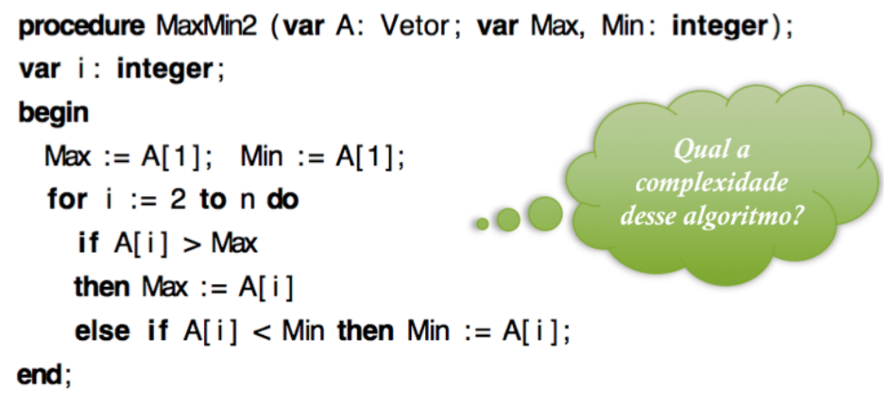
    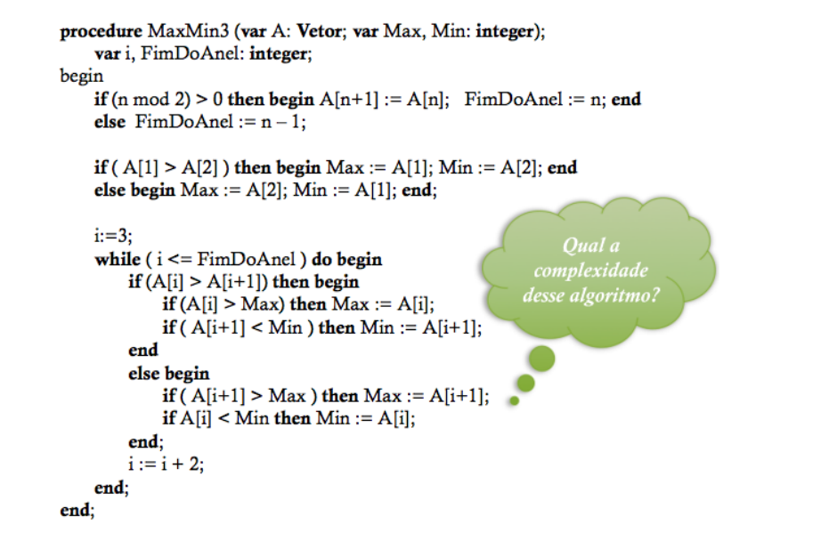

## 📄 Arquivos
- **Main.cpp:** É definido o tamanho da entrada do vetor, e logo depois é feito a randomização para preenchê-lo. Após isso, dentro de um laço while, é chamado as funções dos MinMax's, ordenando em ordem crescente com a função sort e em ordem decrescente com a função reverse.
- **MinMax.hpp:** Criadas a função para cada um dos 3 MinMax's.
- **MinMax.cpp:** Feita a estruturação das funções criadas no arquivo MinMax.hpp.

## Resolução do Problema
<h3><b>Implementando em C++ e Executando</b></h3>
    
- **Implementação:**
    Segue a implementação de cada uma das funções em C++:

    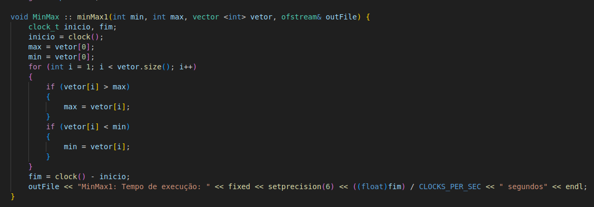
    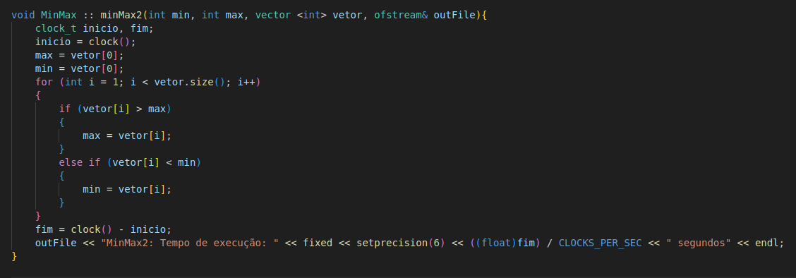
    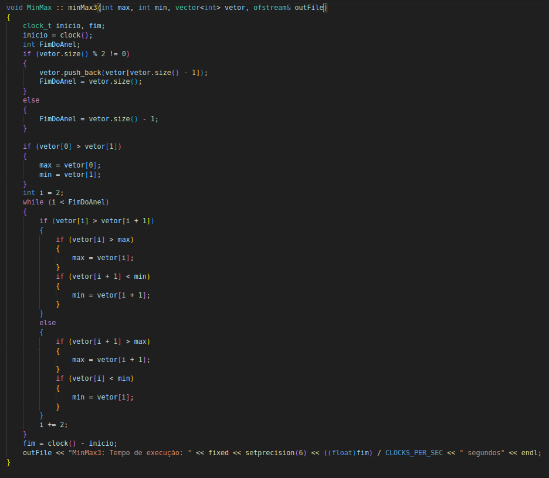

Foram feitas pequenas modificações, como receber o endereço de memória do arquivo de saída como parâmetro, e o uso da função clock para retornar o tempo de execução.

- **Execução:**
    Ao executar o programa ele calcula o tempo gasto pelas funções 10 vezes, e isso é escrito direto em um arquivo .txt:
    
    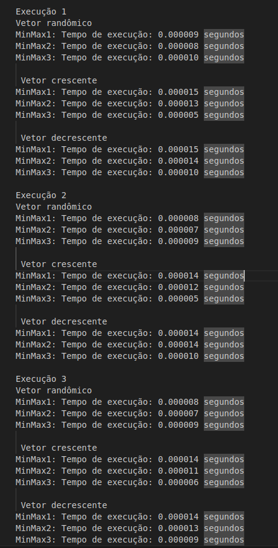

    E como são 4 tamanhos diferentes de entrada, também serão 4 arquivos desse, um para cada tamanho.

<h3><b> Gnuplot </b></h3>

- **Script Geral do gnuplot:**

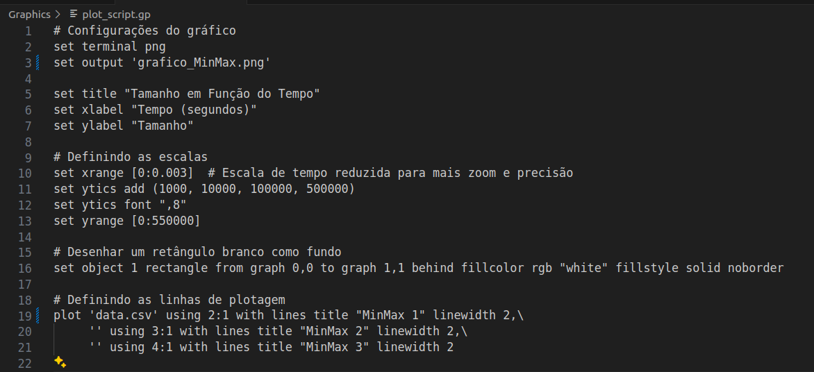

Padrão do script utilizado para a criação dos gráficos, fazendo apenas pequenas alterações de um para outro, como por exemplo o tamanho da entrada ou título.

## Resultados
Os resultados serão apresentados a seguir por meio de tabelas, nas quais mostra todos os tempos calculados e as médias, também já calculadas e também por meio de gráficos, nos quais é possível ter uma melhor visualização do que acontece e a partir de tal, fazer análises e chegar em algumas conclusões.

<h3><b>Tabelas Excel</b></h3>

- **Tabela MinMax1**

- **Tabela MinMax2**
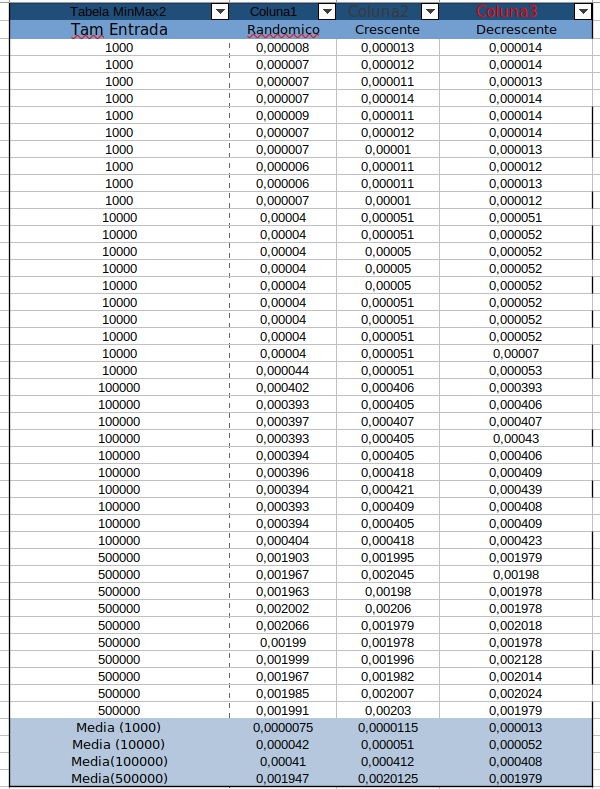

- **Tabela MinMax3**
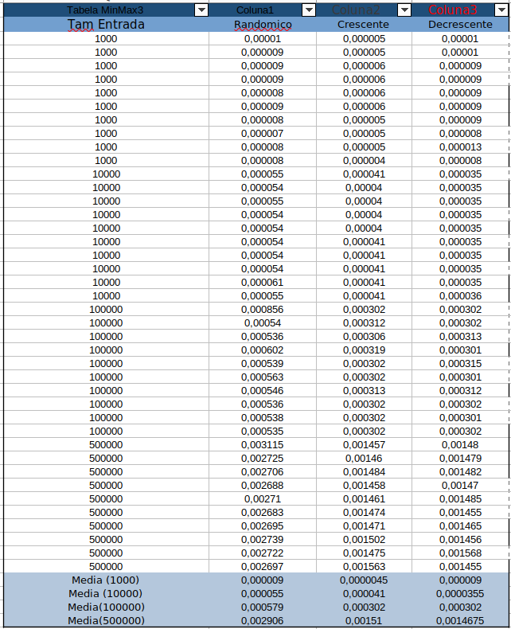

- **Tabela Médias**
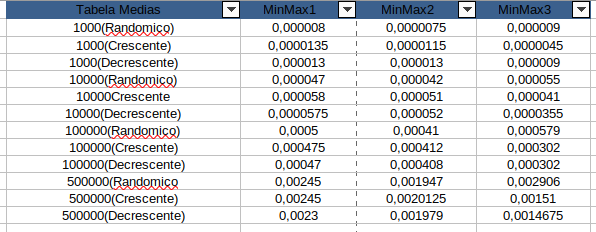

As tabelas foram criadas no aplicativo OnlyOffice no formato .ods

<h3><b> Gráficos </b></h3>

Para uma boa análise eu criei gráficos que contêm os 3 MinMax's, em alguns cenários:

- **Todas as médias**

Este primeiro gráfico mostra uma média geral de todas as entradas e todos os tipos de ordenação do vetor. Nele é visível que no geral o MiMax3 é o algoritmo que tem o melhor desempenho, seguido do MinMax2 e por último o MinMax1. Contudo, em alguns pontos do gráfico o MinMax3 se apresenta sendo o pior, o que ainda veremos ser o caso quando temos vetor ordenado aleatoriamente.

- **Todas as médias com zoom nas entradas 1.000 e 10.000**
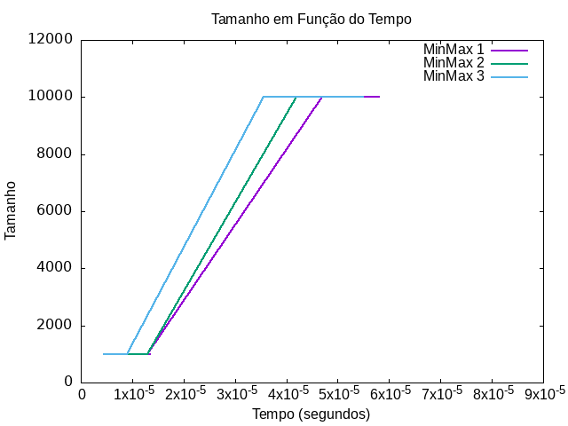

O mesmo gráfico que o comentado acima, porém com um maior zoom e foco nas entradas menores. Analisando-o, fica ainda mais evidente e confirma o comentário do gráfico acima.

- **Médias com vetor randomico**
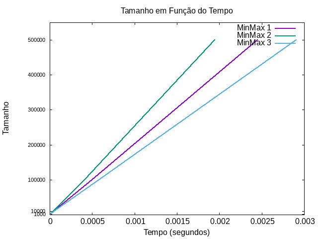

Aqui tem-se um gráfico considerando-se apenas o caso do vetor ordenado de forma aleatória. Como observado no primeiro gráfico, que o MinMax3 se comporta o pior em alguns casos, nesse gráfico conseguimos confirmar isso. Sendo ele o pior, enquanto o MinMax2 é o melhor desempenho e o MinMax1, o caso intermdiário.

- **Médias com vetor crescente**
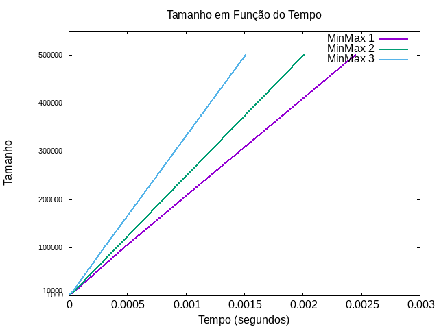

Com o vetor crescente, o comportamento esperado e os melhores desempenhos são respectivamente: MinMax3, MinMax2, MinMax1.

- **Médias com vetor decrescente**
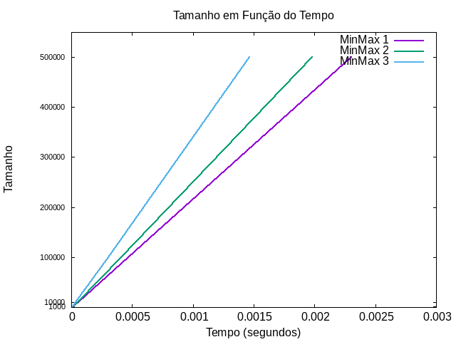

Com o vetor decrescente, o comportamento segue bastante parecido com ele crescente, respeitando o resultado esperado e tendo uma diferença maior ainda entre os tempos. Respectivamente, os melhores desempenhos se mantêm: MinMax3, MinMax2, MinMax1

## Conclusão
Considerando-se todas as análises feitas acima, em relação aos três algoritmos, podemos apontar alguns aspectos que merecem uma atenção.

Por mais que os algoritmos tenham sido executados em um mesmo ambiente e máquina, fica evidente que desapontando a teoria, ao executados mais de uma vez, eles nunca terão o mesmo tempo como resposta, e isso deve a várias variáveis, como o próprio Sistema Operacional (SO), condições climáticas ou condições físicas da máquina em geral.

Também é interessante concluir que esse é um projeto para analisar o desempenho de cada algoritmo e compará-los, mas não apenas para dizer qual é o melhor, pois isso dependeria de mais fatores do que somente esses. Mesmo o MinMax3 sendo melhor na maior parte dos casos, a diferença de tempo se encontra na casa de microsegundos, ou até menos dependendo do tamanho da entrada. Ou seja, talvez por sua maior complexidade do que o MinMax1, por exemplo, que tem uma implementação super simples, pode ser usá-lo não seja o mais viável.

Contudo, o MinMax3 foi o algoritmo com melhor desempenho nos dois primeiros métodos de ordenação: crescente e decrescente, o MinMax2 o melhor para o caso de vetor aleatório e no geral o MinMax1 se apresentou como o pior.  Ou seja, o método com o qual o vetor foi ordenado teve papel fundamental no resultado, com algoritmos que podem ser o melhor numa situação e o pior em outra.

## 👾 Compilação e Execução
* **Especificações da máquina em que o código foi rodado:**
  * Processador AMD Ryzen7 5700u;
  * Sistema Operacional Ubuntu 22.04;
  * 12GB de RAM.

* | Comando         | Função                                                                             |                     
  | ----------------| -----------------------------------------------------------------------------------|
  | `make clean`    | Apaga a última compilação realizada contida na pasta build                           |
  | `make`          | Executa a compilação do programa utilizando o gcc, e o resultado vai para a pasta build |
  | `make run`      | Executa o programa da pasta build após a realização da compilação                     |
